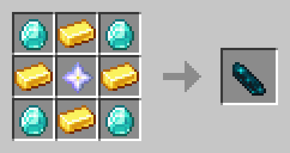

# 🪦 Minecraft hardcore revivce

[](LICENSE)
[](https://www.minecraft.net/)
[](https://papermc.io)

A PaperMC plugin that brings **a second chance to Hardcore mode** — let your friends resurrect fallen players through a mystical ritual involving a *Resurrection Stone* and a *Diamond* ⚡

---

## ✨ Features

- 🧍 **Hardcore revival system:**  
  Made for hardcore worlds!

- 💎 **Custom Resurrection Stone:**  
  Craft a magical stone to bring your friends back to life.

- 🪙 **Ritual-based resurrection:**  
  Throw the **bound Resurrection Stone** and a **Diamond** into a **cauldron** with **water** to resurrect a dead player with lightning and effects.

- 🧾 **Player soul binding:**  
  Use `/bindrevive <player>` to bind a stone to a specific player’s soul.

- ⚡ **Visual & sound effects** for dramatic revival scenes.

---

## 🧰 Requirements

- **Minecraft:** 1.21.10 (or newer)  
- **Server:** [PaperMC](https://papermc.io)  
- **Java:** 17+

---

## 🧱 Project Structure
```
src/main/java/nl/bonniebot/hardcoreRevive/
├── HardcoreRevive.java # Main plugin entry point
│
├── commands/
│ └── BindReviveCommand.java # /bindrevive command
│
├── data/
│ └── DeadPlayerStorage.java # Tracks dead players
│
├── events/
│ ├── PlayerDeathListener.java # Handles deaths
│ └── ItemDropListener.java # Handles resurrection ritual
│
├── items/
│ ├── ResurrectionStone.java # Defines the custom item
│ └── RecipeManager.java # Registers crafting recipes
│
└── util/
├── PlayerUtils.java # Common player helpers
└── RevivalManager.java # Handles the actual revival logic
```
---

## 🧙 Usage

### 🔹 Craft the Resurrection Stone

By default, the recipe is:



---

### 🔹 Bind a Player’s Soul

Hold a **Resurrection Stone** and run:
/bindrevive <playername>

This links the stone to that player’s soul.

---

### 🔹 Perform the Ritual

1. Throw  a **Diamond** into a **cauldron** with **water**.  
2. Throw the **bound Resurrection Stone** in the water.  
3. ⚡ Lightning strikes, and the bound player is **brought back to life** in Survival mode!

---

## 🔐 Permissions

| Node | Default | Description |
|------|----------|-------------|
| `resurrection.bind` | ✅ true | Allows binding a stone to a player’s soul |

---

## 🔧 Configuration

Currently minimal — more configuration options (custom recipes, world restrictions, effect toggles) may be added in the future.

---

## 🧑‍💻 Contributing

Contributions are welcome!  
If you’d like to:
- Add new items (e.g., *Soul Crystals*, *Totem of Restoration*)  
- Improve effects or visuals  
- Fix bugs or optimize code  

Just fork the repo and submit a pull request.  
Make sure to follow the existing code style and include a brief description of your changes.

---

## 🧾 License

This project is licensed under the **MIT License** — see the [LICENSE](LICENSE) file for details.
